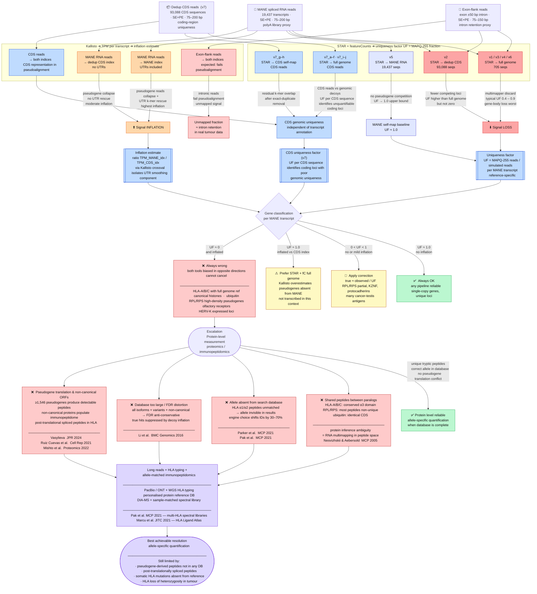

# Comparison scheme — mappability correction project

Overview of what is compared, why, and the escalation path when short-read RNA-seq is insufficient.

---

## Comparison design

| Read source | STAR reference | Kallisto index | Expected bias | Script series |
|---|---|---|---|---|
| MANE RNA | Full genome (705 seqs) | — | ⬇ Signal LOSS — multimapper discard | v1, v3, v4, v6 |
| MANE RNA | Dedup CDS (93,088 seqs) | — | ⬇ Partial LOSS — fewer competitors | v2 |
| MANE RNA | MANE RNA (19,437 seqs) | — | UF → 1.0 — self-mapping upper bound | v5 |
| MANE RNA | — | MANE index (UTRs) | ⬆ INFLATION — pseudogene collapse + UTR rescue | Kallisto crossval |
| MANE RNA | — | Dedup CDS index | ⬆ INFLATION moderate — no UTR rescue | Kallisto crossval |
| Exon-flank | Full genome / dedup CDS | — | Intronic reads — intron retention proxy | v1–v2 (flank) |
| Exon-flank | — | Both indices | Unmapped fraction — expected pseudoalignment failure | Kallisto crossval |
| Dedup CDS | Full genome | — | CDS genomic uniqueness — identifies problematic coding loci | v7_a–f, v7_i–j |
| Dedup CDS | CDS self-map | — | Within-CDS redundancy — residual overlap after dedup | v7_g–h |
| Dedup CDS | — | Both indices | CDS representation in pseudoalignment space | Kallisto crossval |

UTR smoothing contribution = (Kallisto TPM with MANE index) − (Kallisto TPM with dedup CDS index), for the same MANE RNA read set.

---

## Flowchart — bias, classification, and escalation

---

## Summary

The central result is that **no single tool and reference combination is unbiased for all genes**. Signal loss (STAR + full genome) and signal inflation (Kallisto + MANE) are not random noise — they are systematic, locus-specific, and directional. Any prediction model, immune score, or cross-cohort comparison that uses RNA-seq expression from pseudogene-dense loci without correction inherits this bias as a fixed systematic error.

Protein-level measurement resolves some cases but faces structurally identical problems in peptide space: shared peptides (= RNA multimapping), missing alleles in the database (= reference mismatch), and pseudogene-derived peptides absent from any database (= Kallisto inflation from non-canonical sources).

The most accurate allele-specific quantification requires long reads with HLA typing and a sample-matched immunopeptidomics database — and even then, somatic HLA mutations and post-translational peptide splicing remain unresolved in standard workflows.
